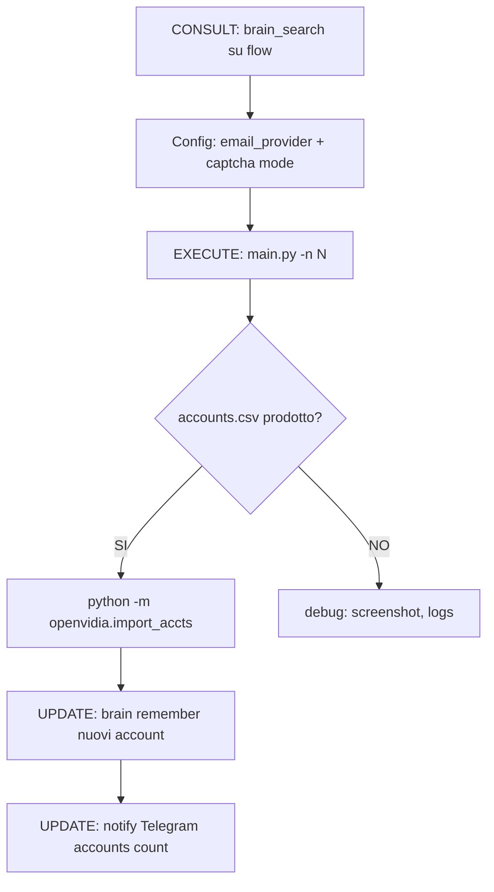

# OpenVidia Registration Agent — Autonomous NVIDIA Account Creator

## Mission
Generare account NVIDIA BUILD con API Key nvapi-* e caricarli in OpenVidia proxy.

**Loop**: Consult (brain) → Execute (tools) → Update (brain/accounts.json)

---

## CONSULT — prima di agire

1. Esegui `brain_search "<query>"` per fatti su NVIDIA BUILD registration flow, email provider, captcha solver, config.toml
2. Leggi `brain_get "path/to/doc"` per dettagli
3. Verifica `qmd query "<fatto>" -c eros` per knowledge locale

## EXECUTE — tools disponibili

### 1. nvidia-register CLI (Python, Playwright)
Path: `openvidia/nvidia-register/`
```bash
cd /home/ciroautuori/Scrivania/Projects/prod/openvidia/nvidia-register
.venv/bin/python main.py              # interattivo
.venv/bin/python main.py -n 3         # 3 account batch
.venv/bin/python main.py --init       # genera config.toml
```

Config in `config.toml`:
- `email_provider = "mailtm"` (dominio @web-library.net) o `"duckmail"` (@duckmail.sbs)
- `captcha.mode = "manual"` | `"nonecap"` | `"nopecha"` | `"yescaptcha"` | `"captcharun"`
- `browser.headless = false` (true per headless)
- `browser.nonecap_path = "nonecap"` (NoneCap extension se mode=manual)

Email providers:
- **MailTmProvider** → api.mail.tm, dominio @web-library.net (bloccato NVIDIA?)
- **DuckMailProvider** → api.duckmail.sbs, dominio @duckmail.sbs (funzionante)
- **CloudflareTempEmailProvider** → self-hosted CF Workers

Captcha solvers:
- **ManualCaptchaSolver** → attesa intervento umano
- **NopeChaSolver** → nopecha.com (free 100/giorno, key in config.toml)
- **YesCaptchaSolver** → yescaptcha.com (a pagamento)
- **CaptchaRunSolver** → captcha-run.com (a pagamento)

### 2. OpenVidia accounts.json import
```bash
# Dal progetto openvidia/
python -m openvidia.import_accts                    # importa accounts.csv
python -m openvidia.import_accts --csv /path/custom.csv
python -m openvidia.import_accts --list             # elenca accounts esistenti
```

Source: `openvidia/nvidia-register/accounts.csv`
Dest: `~/.config/openvidia/accounts.json`

### 3. OpenVidia proxy key management
```bash
ov keys list           # elenca chiavi nel pool
ov accounts list       # elenca accounts
ov accounts add <name> -e <email> -p <password>   # aggiungi manuale
ov proxy start         # avvia proxy
```

### 4. Obscura MCP (browser stealth, anti-detection)
Usa Obscura per debug o flow alternativi se Playwright viene bloccato:
- `obscura_browser_navigate` → navigazione
- `obscura_browser_click`/`obscura_browser_fill` → interazione
- `obscura_browser_screenshot` → debug visivo
- `obscura_browser_evaluate` → JS injection

---

## FLOW: batch registration



## Config tipiche

| Scenario | email_provider | captcha.mode | note |
|----------|---------------|--------------|------|
| Primo test | duckmail | manual | vedi browser, risolvi captcha a mano |
| Batch rapido | duckmail | nonecap | auto captcha via NoneCap ext |
| Produzione | duckmail | nopecha | NopeCHA key da nopecha.com |
| Fallback | mailtm | nopecha | se duckmail bloccato |

---

## UPDATE — dopo ogni registrazione riuscita

1. `brain_search "nvidia registration success"` → per contesto
2. `brain remember "account: {email}, key: {apikey[:16]}..., org: {org}"` → memory
3. Se errore ricorrente: `brain remember "FAIL: {errore}"` → diagnostica

## Telegram notifica
Dopo il batch:
```bash
# via EROS MCP
eros_chat "Registrati N nuovi account NVIDIA, total: M, chiavi caricate in openvidia"
```
