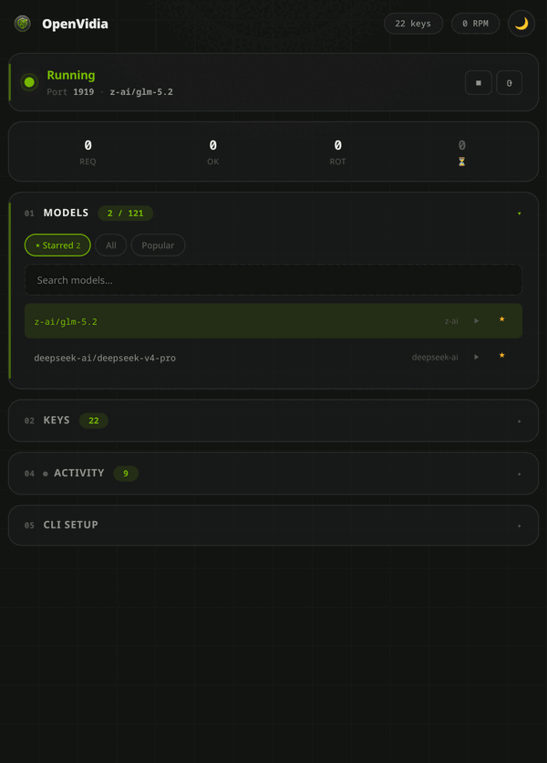

# OpenVidia


[](https://github.com/ciroautuori/openvidia/actions/workflows/ci.yml)


**Multi-key proxy for NVIDIA NIM with a native desktop dashboard.**

<p align="center">
  
</p>

Pool multiple free-tier API keys behind one endpoint. Automatic rotation, per-key cooldown, sliding-window RPM limiting, and a compact desktop app — no browser needed.

Built for [opencode](https://opencode.ai), [Codex CLI](https://github.com/openai/codex), [Claude Code](https://docs.anthropic.com/en/docs/claude-code), [Grok](https://x.ai), and any OpenAI-compatible client.

---

## Quick Start

### Linux (Arch / Ubuntu / Fedora)

```bash
git clone https://github.com/ciroautuori/openvidia.git
cd openvidia
./install.sh
```

Or manually:

```bash
# Install uv (recommended) — https://astral.sh/uv
curl -LsSf https://astral.sh/uv/install.sh | sh

uv sync                          # install dependencies
uv run openvidia setup           # auto-configure opencode
uv run openvidia                 # start proxy + desktop app
```

With pip:

```bash
pip install -e .
openvidia setup
openvidia
```

### macOS

```bash
brew install python@3.12 pygobject pkg-config
git clone https://github.com/ciroautuori/openvidia.git
cd openvidia
pip install -e .
openvidia setup
openvidia
```

> pywebview on macOS uses system WebKit (native, no extra deps).
> If you hit a GTK build error, install `pygobject` via Homebrew or just skip it — macOS doesn't need it.

### Windows

```cmd
git clone https://github.com/ciroautuori/openvidia.git
cd openvidia
pip install -e .
openvidia setup
openvidia
```

> pywebview on Windows uses EdgeChromium (WebView2, pre-installed on Windows 10/11).
> If WebView2 is missing, install it from [Microsoft](https://developer.microsoft.com/en-us/microsoft-edge/webview2/).

### Optional: Auto key regeneration

If you want keys to auto-regenerate when they die (requires a headless browser):

```bash
pip install -e ".[auto-regen]"
playwright install chromium
```

Without this, dead keys stay parked until you manually replace them.

---

## How It Works

```
┌─────────────────────────────────────────────────────────────┐
│                     OpenVidia (:1919)                       │
│                                                             │
│  ┌─────────────────────────────────────────────────────┐    │
│  │               Desktop App (pywebview)               │    │
│  │  310×570 native window — Keys, Presets, Models,     │    │
│  │  Activity log, CLI setup — all in one panel         │    │
│  └─────────────────────────────────────────────────────┘    │
│                          │                                  │
│  ┌─────────────────────────────────────────────────────┐    │
│  │               Proxy Engine (:1919/v1)               │    │
│  │                                                     │    │
│  │  Request → override model → pick key → forward      │    │
│  │            ↑                ↑           ↑           │    │
│  │            │            cooldown?   RPM < 28?       │    │
│  │            │            skip if yes  skip if no     │    │
│  │            │                                        │    │
│  │  On 429: read Retry-After → set cooldown → next key │    │
│  │  On 401/403: cooldown 3600s (dead key)              │    │
│  │  On 5xx: cooldown 30s (transient)                   │    │
│  └─────────────────────────────────────────────────────┘    │
│                          │                                  │
│                   NVIDIA NIM API                            │
│            integrate.api.nvidia.com/v1                      │
└─────────────────────────────────────────────────────────────┘
```

---

## Why?

NVIDIA's free NIM tier limits each API key to ~40 RPM. Aggressive bursts trigger a **penalty box** that can lock keys for hours. OpenVidia:

- **Pools multiple keys** behind a single endpoint
- **Rotates automatically** on 429/401/403/5xx — zero manual intervention
- **Per-key cooldown timers** — on real 429s, trusts `Retry-After` exactly (no multiplication); distinguishes transient worker saturation (`ResourceExhausted`) from true RPM limits and never burns key cooldowns for the former
- **Sliding-window RPM limiting** — keeps each key under 28 RPM (safe margin below 40)
- **Health checks** — revives keys whose cooldowns have expired
- **No silent model substitution** — the model you select is the model that answers; if it fails on every key you are told so, never handed output from a different model
- **Auto-compaction** — summarizes long histories so requests never fail on context overflow ([details](#auto-compaction))

---

## CLI Commands

| Command | Description |
|---------|-------------|
| `openvidia` | Start proxy in background + open desktop app |
| `openvidia foreground` | Foreground mode (logs to stdout, no UI) |
| `openvidia setup` | Auto-configure **all** detected CLIs: opencode, Codex, Claude Code, Grok |

---

## CLI Setup Guides

> **TL;DR — run `openvidia setup` once.** It auto-detects and configures every CLI you have installed. You only need to read the manual steps below if something doesn't work or you prefer to configure things yourself.

Supported clients:

| CLI | Protocol | Endpoint | Auto-setup |
|-----|----------|----------|------------|
| **opencode** | OpenAI-compatible | `http://localhost:1919/v1` | ✅ `openvidia setup` |
| **Codex CLI** | OpenAI Responses API | `http://localhost:1919/v1` | ✅ `openvidia setup` |
| **Claude Code** | Anthropic Messages API | `http://localhost:1919` | ✅ `openvidia setup` |
| **Grok (xAI)** | OpenAI-compatible | `http://localhost:1919/v1` | ✅ `openvidia setup` |

---

### opencode

```bash
openvidia setup    # configures provider + model + compaction + instructions
opencode           # then /model openvidia
```

Manual (if `setup` didn't find it):

```bash
# ~/.config/opencode/opencode.json
{
  "provider": {
    "openvidia": {
      "npm": "@ai-sdk/openai-compatible",
      "options": { "apiKey": "ignored", "baseURL": "http://localhost:1919/v1" },
      "models": { "openvidia": { "name": "OpenVidia", "tools": true } }
    }
  },
  "model": "openvidia/openvidia"
}
```

---

### Codex CLI

```bash
openvidia setup    # writes ~/.codex/config.toml automatically
codex --model openvidia
```

Manual (if `setup` didn't find it):

```toml
# ~/.codex/config.toml
model = "openvidia"
model_provider = "openvidia"

[model_providers.openvidia]
name = "OpenVidia"
base_url = "http://localhost:1919/v1"
env_key = "OPENVIDIA_API_KEY"
wire_api = "responses"
```

```bash
export OPENVIDIA_API_KEY=ignored   # also added automatically by setup
```

---

### Claude Code

```bash
openvidia setup    # writes ANTHROPIC_BASE_URL + ANTHROPIC_API_KEY to your shell rc
source ~/.zshrc    # (or restart your terminal)
claude --model openvidia
```

Manual (if `setup` didn't find `claude`):

```bash
# Add to ~/.zshrc or ~/.bashrc
export ANTHROPIC_BASE_URL=http://localhost:1919
export ANTHROPIC_API_KEY=ignored
```

> The `/v1/messages` endpoint translates Anthropic Messages format ↔ NVIDIA chat/completions bidirectionally — streaming, tool use, and system prompts all work.
>
> **Images:** NVIDIA NIM models are text-only. Image blocks (e.g. screenshots) are replaced with `[image omitted: model has no vision]` so the model stays aware of the context and logs a warning in the Activity panel.

---

### Grok (xAI)

```bash
openvidia setup    # writes ~/.grok/config.toml automatically
grok -m openvidia
```

Manual (if `setup` didn't find `~/.grok/`):

```toml
# ~/.grok/config.toml
[models]
default = "openvidia"

[model.openvidia]
api_key = "ignored"
base_url = "http://localhost:1919/v1"
api_backend = "chat_completions"
context_window = 128000
```

---

### Any OpenAI-compatible client

```python
from openai import OpenAI

client = OpenAI(base_url="http://localhost:1919/v1", api_key="ignored")
response = client.chat.completions.create(
    model="openvidia",
    messages=[{"role": "user", "content": "Hello!"}]
)
```

```bash
curl http://localhost:1919/v1/chat/completions \
  -H "Content-Type: application/json" \
  -H "Authorization: Bearer ignored" \
  -d '{"model":"openvidia","messages":[{"role":"user","content":"Hello!"}]}'
```

Streaming (SSE) is fully supported — tokens flow through unbuffered.

---

## Smart Rate Limiting

### Per-Key Cooldown

| HTTP Status | Cooldown | Reason |
|-------------|----------|---------|
| **429** (real RPM limit) | `Retry-After` header (trusted as-is, no multiplication), or 45s + jitter | Rate limited — honour NVIDIA's own window exactly |
| **429** (worker concurrency) | 0 — retried after 0.8s pause | `ResourceExhausted: Worker local total request limit reached` — transient pool saturation, key is healthy |
| **401 / 403** | 3600s | Dead key — don't waste requests |
| **400 / 404** | — (no cooldown) | Deterministic request error — returned to the client immediately, **key untouched**. Rotating wouldn't help: every key gets the same error. |
| **5xx** | 10s (gateway timeout) / 30s (other) | Server error — retry soon |
| **Network error** | 30s | Transient connectivity issue |

> **Retry-After is used as-is.** When NVIDIA provides a `Retry-After` header (e.g. 60s), the cooldown is exactly that value. Earlier versions multiplied it by an adaptive factor (`1.5^N`), which caused a doom loop: at 3 failures a 60s backoff became 135s and all 26 keys locked out longer than the real rate-limit window required.
>
> When no `Retry-After` is provided the proxy uses 45s + random jitter (≤10s), scaled at most 1.5× for repeated failures — capped at ~65s max.

### Sliding-Window RPM

Each key tracks requests in a rolling 60-second window. If a key has sent **28+ requests** in the last 60s, it is skipped. Only if all keys are simultaneously RPM-saturated or on cooldown does the proxy return 429 to the client.

### Key Rotation Flow

```
Request arrives
    │
    ├─ For each candidate key (ordered least-loaded first):
    │   ├─ Key on cooldown?  → skip (including keys cooled mid-pass)
    │   ├─ Key RPM ≥ 28?    → skip
    │   ├─ Send to NVIDIA   → 200? ✅ record RPM, return response
    │   │                   → 400/404? return to client (no rotation, key untouched)
    │   │                   → 429 ResourceExhausted? pause 0.8s, retry (key untouched)
    │   │                   → 429 rate-limit? use Retry-After as-is, set cooldown, next key
    │   │                   → 401? set 3600s cooldown, next key
    │   │                   → 5xx? set 10–30s cooldown, next key
    │   └─ (max 5 sends per pass, 3 passes with 1s pause between)
    │
    └─ All candidates exhausted? → 503 naming the model (never a substitute model)
```

### Health Check

Every 30 seconds:
1. Finds keys still on cooldown
2. Sends a lightweight `GET /v1/models` probe
3. If the key responds OK — clears the cooldown (revived)
4. If still failing — leaves the cooldown in place

---

## Auto-Compaction

Long conversations eventually exceed the model's context window. Without handling, the upstream returns a `400`, and — since that error is identical on every key — a naive proxy would burn through the whole pool before dying. **OpenVidia never blocks on context overflow.**

Before forwarding a request, if the estimated history exceeds a token budget, OpenVidia compacts it:

```
history > budget?
    │
    ├─ Cached summary still fits?
    │      └─ Serve summary + EVERY later message verbatim.  ← steady state,
    │         zero upstream calls. The summary boundary only moves when this
    │         no longer fits, so you pay for a summarize once every N turns.
    │
    ├─ Boundary must advance → summarize the oldest slice on top of the
    │      previous summary (incremental — never the whole history again).
    │      The verbatim tail is sized to FILL the remaining budget.
    │
    └─ Summary not ready before `inline_deadline`?
           └─ Serve now (cached summary + verbatim remainder, or a
              deterministic trim) while the summarize keeps running
              detached and lands in the cache for the next turn.
```

- **Never blocks the client** — the request waits at most `inline_deadline` seconds, regardless of how slow the upstream is. Compaction latency is bounded by config, not by the provider.
- **Works for every client** — hooks `/v1/chat/completions` (opencode / Codex), `/v1/responses`, and the `/v1/messages` Anthropic shim (Claude Code).
- **Cheap** — the steady state costs zero extra calls; only genuinely new content is ever summarized, and concurrent requests on the same conversation share a single summarize.
- **Safe** — every fallback is bounded, so a request goes through even with the whole key pool rate-limited.

Watch it in the **Activity** log: `⧉ compaction: summarized N new msg (covers M) → …`.

### Tuning

> **Set `model_budgets` first.** The generic default (80k) is deliberately conservative because NVIDIA NIM does not advertise a context window on `/v1/models`. If your model accepts more, compaction at 80k throws away context you paid nothing for. To find the real number, send an oversized request — the `400` states it exactly:
>
> ```
> This model's maximum context length is 202752 tokens. However, your
> messages resulted in 320011 tokens.
> ```

Optional — create `~/.config/openvidia/compaction.json` (built-in defaults shown):

```json
{
  "enabled": true,
  "budget_tokens": 80000,
  "model_budgets": { "your-provider/your-model": 160000 },
  "reserved_tokens": 8000,
  "compact_ratio": 0.6,
  "keep_recent": 8,
  "summary_model": "",
  "summary_max_tokens": 1024,
  "inline_deadline": 6.0,
  "summarize_timeout": 45.0
}
```

| Field | Meaning |
|-------|---------|
| `enabled` | Turn compaction on/off |
| `budget_tokens` | Generic trigger for any model without an explicit budget |
| `model_budgets` | Per-model context window. **The one setting worth tuning** — leave ~20% headroom, the estimator is a ~4 chars/token approximation |
| `reserved_tokens` | Generation headroom subtracted from the budget |
| `compact_ratio` | Compact down to this fraction of the budget. Landing exactly on the threshold re-triggers compaction on the very next turn |
| `keep_recent` | Floor for the trim fallback. On the summary path the verbatim tail is sized to fill the budget instead |
| `summary_model` | Model used to summarize. Point it at a **fast** model: it runs on a different traffic stream than the one your agent is saturating. Empty = the default model |
| `summary_max_tokens` | Cap on the generated summary length |
| `inline_deadline` | Seconds the *client request* will wait for a summary before being served from the fallback ladder |
| `summarize_timeout` | Upstream cap for the summarize call itself, which continues in the background past the deadline |

---

## Desktop App

Native window via [pywebview](https://pywebview.flowrl.com/). Opens at **310×570 px** — a compact utility panel, like a phone in portrait. Resize freely.

| Backend | Platform | Engine |
|---------|----------|--------|
| **Qt WebEngine** | Linux (KDE/Wayland) | PyQt6-WebEngine (native, best experience) |
| **GTK WebKit** | Linux (GNOME/X11) | PyGObject + WebKitGTK |
| **WebKit** | macOS | system WebKit (no extra deps) |
| **EdgeChromium** | Windows | WebView2 (pre-installed on Win 10/11) |

pywebview auto-detects the best available backend.

### Linux desktop integration

```bash
# .desktop file (auto-installed by install.sh)
cp openvidia.desktop ~/.local/share/applications/
# Icon
cp web/assets/logo.png ~/.local/share/icons/hicolor/256x256/apps/openvidia.png
update-desktop-database ~/.local/share/applications/
```

---

## Dashboard Sections

| Section | Features |
|---------|----------|
| **Status** | Proxy state, active model, start/stop/restart controls |
| **Stats** | Request count, success rate, rotations, cooldown counter |
| **Keys** | Per-key status (Active filter default), live cooldown countdown, RPM, success/fail, freshness dots, add/remove/copy |
| **Models** | Single list — filters: **★ Starred** (default; your quick-switch shortlist) · All · Popular. Search, test ▶, star/unstar. Active model highlighted and pinned to top. |
| **Thinking** | `auto` / `on` / `off` next to the active model — a hybrid reasoning model emits nothing while it thinks |
| **Activity** | Real-time SSE log stream with color-coded levels |
| **CLI Setup** | Copy-paste config for opencode / Codex / Claude / Grok |

### Key Status Indicators

| Indicator | Meaning |
|-----------|---------|
| 🟢 Green | Key healthy, has successful requests |
| 🟡 Amber | Key has failures but not on cooldown |
| ⚪ Gray | Key idle (no requests yet) |
| 🔴 Red + ⏳ | Key on cooldown — shows countdown + reason |
| `active` badge | Currently selected key in rotation |

---

## Configuration

### Config directory

| Platform | Path |
|----------|------|
| **Linux** | `~/.config/openvidia/` |
| **macOS** | `~/Library/Application Support/openvidia/` |
| **Windows** | `%APPDATA%\openvidia\` |

### Config files

| File | Purpose |
|------|---------|
| `keys.json` | API keys (JSON array) |
| `presets.json` | ★ Starred models — quick-switch shortlist |
| `active_model` | Currently active model (persists across restarts) |
| `index` | Key rotation index |
| `compaction.json` | Auto-compaction tuning (optional — see [Auto-Compaction](#auto-compaction)) |
| `timeouts.json` | Upstream timeouts (optional — see [Slow models](#slow-models)) |
| `model_limits.json` | Context windows the proxy learned by itself — never edit by hand |
| `model_options.json` | Reasoning toggle + the payload used to express it (see [Thinking](#thinking-reasoning-toggle)) |
| `accounts.json` | Legacy accounts (auto-extracted to keys.json) |

Add keys via the dashboard (**Keys** section) or edit `keys.json`:

```json
["nvapi-xxx", "nvapi-yyy", "..."]
```

### Thinking (reasoning toggle)

A hybrid reasoning model emits **nothing at all** while it thinks. That is the
whole difference between a 2-second and a 160-second first token, and it is
not something you can see from the outside — the socket just sits there.

Three buttons next to the active model in the dashboard: `auto` (send nothing,
let the model decide), `on`, `off`. The setting is per-model and stored
server-side, so all four CLIs pick it up without touching their own configs.

The **parameter name is configuration, not code**. Providers spell this flag
differently and rename it every model generation, so `model_options.json`
carries the payload to merge:

```json
{
  "thinking": "auto",
  "thinking_off_payload": { "chat_template_kwargs": { "enable_thinking": false } },
  "thinking_on_payload":  { "chat_template_kwargs": { "enable_thinking": true } },
  "per_model": { "vendor/model": { "thinking": "off" } }
}
```

A future model that wants `{"reasoning_effort": "none"}` instead needs an edit
here, not a release. The merge only fills what the client did not set, at
every level of nesting: a CLI that spells the parameter out in its own request
has made an explicit choice and wins.

---

### Context windows are learned, not configured

A model the proxy has never seen must reach full context with **zero**
configuration — providers add models continuously, and a hand-maintained
budget table means every new model runs silently truncated until someone
notices.

NVIDIA does not advertise the window on `/v1/models`, but it states it exactly
when a request exceeds it:

```
This model's maximum context length is 202752 tokens.
However, your messages resulted in 320011 tokens.
```

So the proxy asks once, in the background, caches the answer in
`model_limits.json`, and also harvests it from any real overflow. Precedence:
your `model_budgets` override → learned → the conservative default. An unknown
model is never allowed to overflow while it is being learned.

The day your provider ships a new flagship, you select it and it runs at full
context. Nothing to configure.

---

### No pinned model

There is no `DEFAULT_MODEL` constant. The model a request runs on is resolved
live: your active selection, then the first starred preset, otherwise an error
saying no model is selected. A hardcoded model name is a liability the day the
provider retires it, and it silently overrides what you picked.

---

### Slow models

A `read` timeout is the wait for the **first byte**, and a reasoning model
emits nothing at all while it thinks. Measured on the NVIDIA free tier, the
same key, within the same minute:

| Model | Time to first token |
|-------|---------------------|
| `deepseek-ai/deepseek-v4-flash` | 2.1s |
| `deepseek-ai/deepseek-v4-pro` | 12.3s |
| `minimaxai/minimax-m3` | 44.5s |
| `z-ai/glm-5.2` | 2–4s (thinking=off) / 162s (thinking=on) |

Provider capacity for one model can collapse without warning while the others
stay fast — so a timeout short enough to feel responsive is also short enough
to make a slow model **fail on every key in the pool**. OpenVidia therefore
waits (default 240s) and keeps the SSE stream alive with periodic comments, so
your CLI can tell "thinking" from "dead". A read timeout never puts a key on
cooldown: the key connected fine and the upstream accepted the request — it is
the model that is slow, and cooling keys down for it drains the whole pool.

Override in `~/.config/openvidia/timeouts.json`:

```json
{ "connect": 5.0, "read": 240.0, "write": 30.0, "pool": 240.0 }
```

If a model is too slow to work with, switch model in the dashboard. OpenVidia
will not silently answer from a different one.

### Rate limit tuning

Constants in `openvidia/proxy_state.py`:

```python
MAX_RPM = 28              # Safe margin below NVIDIA's 40 RPM limit
RPM_WINDOW = 60.0         # Sliding window in seconds

COOLDOWN_DURATIONS = {
    401: 3600.0,          # Unauthorized — dead key
    403: 3600.0,          # Forbidden — dead key
    429: 180.0,           # Rate limited (Retry-After overrides)
}
# 400/404 are deterministic content errors: the key is left untouched,
# so rotating on them would only burn cooldown budget.
DEFAULT_COOLDOWN = 30.0   # Network errors, unknown 5xx
```

---

## API Endpoints

### Proxy

| Method | Path | Description |
|--------|------|-------------|
| `*` | `/v1/{path}` | Forward to NVIDIA NIM (streaming supported) |
| `POST` | `/v1/responses` | OpenAI Responses API shim (Codex CLI) |
| `POST` | `/v1/messages` | Anthropic Messages API shim (Claude Code) |
| `GET` | `/v1/models` | List available models from upstream |
| `GET` | `/health` | Health check — key count, port, status |

### Dashboard

| Method | Path | Description |
|--------|------|-------------|
| `GET` | `/api/status` | Proxy running state + cooldown count |
| `GET` | `/api/stats` | Requests, rotations, success, cooldowns, total RPM |
| `GET` | `/api/keys/stats` | Per-key: requests, success/fail, cooldown, RPM, reason |
| `GET` | `/api/keys` | List keys |
| `POST` | `/api/keys` | Replace all keys |
| `POST` | `/api/keys/add` | Add a key |
| `POST` | `/api/keys/remove` | Remove a key |
| `GET/POST` | `/api/model` | Get/set active model override |
| `GET/POST` | `/api/presets` | Get/save model presets |
| `GET/POST` | `/api/thinking` | Get/set the reasoning mode of the active model (`auto` / `on` / `off`) |
| `GET` | `/api/model-health` | What the proxy learned from live traffic: per-model success rate, median time to first token, gateway timeouts, 429s |
| `POST` | `/api/test-model` | Test a model directly (bypasses override) |
| `POST` | `/api/stop` | Stop proxy (returns 503 to clients) |
| `POST` | `/api/start` | Resume proxy |
| `POST` | `/api/restart` | Zero-downtime restart (spawn new, kill old) |
| `GET` | `/api/logs/stream` | SSE log stream (real-time) |
| `GET/POST` | `/api/accounts` | Manage legacy accounts (auto-regen) |
| `POST` | `/api/accounts/active` | Set active account |

---

## Tech Stack

- **[FastAPI](https://fastapi.tiangolo.com/)** — async web framework
- **[httpx](https://www.python-httpx.org/)** — HTTP/2 client for upstream
- **[uvicorn](https://www.uvicorn.org/)** — ASGI server
- **[pywebview](https://pywebview.flowrl.com/)** — native desktop window (Qt/GTK/WebKit/EdgeChromium)
- **[psutil](https://github.com/giampaolo/psutil)** — cross-platform process management
- **Vanilla HTML/CSS/JS** — zero frontend build, no node_modules
- **Python 3.12+** — single process, no external services

---

## License

MIT

---

Built by [Ciro Autuori](https://github.com/ciroautuori).
